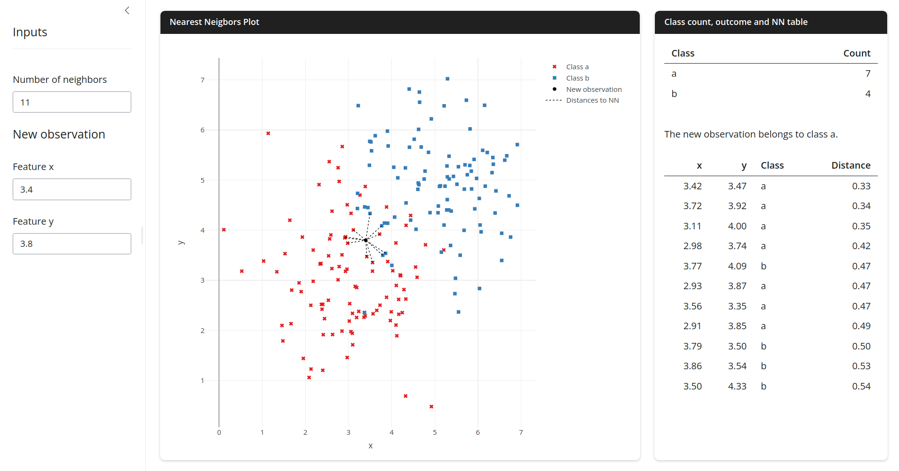

## Visualization of k Nearest Neighbors

A Shiny app that visualizes k nearest neighbors to a new observation. The

training dataset is synthetic and the class overlap is deliberatly minimal.

There are inputs for the number of neighbors and for the features of the

new observation. The main output is a scatter plot of the training dataset,

which also includes the new observation and the distances, which are plotted

as line segments, from the new observation to it's k nearest neighbors. In

addition there are a class count table, the outcome of the classification and

a table of the nearest neighbors. The plot is updated using the `"restyle"`

method of `plotly`. Proper restyling of the line segments was implemented with

the assistance of AI.

A screenshot of the app:

